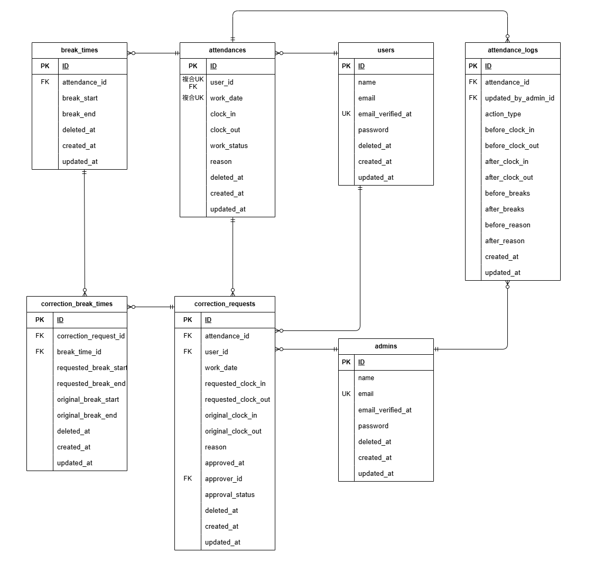

# coachtech 勤怠管理アプリ

## 環境構築

1. リポジトリをクローン

    ```bash
    git clone git@github.com:kawamata-natsuki/coachtech-attendance.git
    ``` 

2. クローン後、プロジェクトディレクトリに移動してVSCodeを起動
    ```bash
    cd coachtech-attendance
    code .
    ```

3. Dockerを起動する  
Docker Desktopを起動してください。  

4. プロジェクトルートにDocker用.env を作成する （Laravelの.envとは別物です） 
    ```bash
    touch .env
    ```

5. Docker 用 UID / GID を設定  
    UID/GIDは `id -u` / `id -g` コマンドで確認できます。  
    自分の環境に合わせてUID/GIDを設定してください。  
    設定例: 
    ```bash
    UID=1000
    GID=1000
    ```

6. `docker-compose.override.yml`の作成  
    `docker-compose.override.yml` は、開発環境ごとの個別調整（ポート番号の変更など）を行うための設定ファイルです。  
    `docker-compose.yml` ではポートは設定されていないため、各自 `docker-compose.override.yml` を作成して、他のアプリケーションと競合しないポート番号を設定してください:     
    ```bash
    touch docker-compose.override.yml
    ```
    設定例:  
    ```yaml
    services:
      nginx:
        ports:
          - "8090:80"             # 開発環境用のNginxポート
    
      php:
        build:
          context: ./docker/php
          dockerfile: Dockerfile
          args:
            USER_ID: 1000         # .envで指定したUIDを使用
            GROUP_ID: 1000        # .envで指定したGIDを使用
        ports:
          - "5173:5173"           # Viteのホットリロード用ポート

      phpmyadmin:
        ports:
          - "8091:80"             # phpMyAdmin用ポート
    ```

7. 初期セットアップ  
    プロジェクトルートで以下のコマンドを実行し、初期セットアップを行います：
    ```bash
    make init
    ```
    `make init` では以下が自動で実行されます：
    - Dockerイメージのビルド
    - コンテナ起動
    - Laravel用 .env（.env.example → .env）配置
    - Composer依存インストール
    - APP_KEY生成
    - DBマイグレーション・シーディング

## フロントエンドセットアップ（Vite）
本案件では、Viteを用いて勤怠登録画面の日時をリアルタイムで更新・取得しています。  

1. Node.js をインストール  
Node.jsがインストールされていない場合は、公式サイトなどからインストールしてください。

2. 依存パッケージのインストール  
プロジェクト直下で以下を実行します：
    ```bash
    npm install
    ```

3. Vite の開発サーバー起動  
以下のコマンドで勤怠登録画面の日時をリアルタイムで反映できます：  
※npm run devを起動していないと、JavaScriptによる時刻自動更新などのフロント機能が動作しません。  
    ```bash
    npm run dev
    ```

## 権限設定

本模擬案件では Docker 内で `appuser` を作成・使用しているため、基本的に `storage` や `bootstrap/cache` の権限変更は不要です。  
ただし、ファイル共有設定やOS環境によっては権限エラーになる場合があるため、その場合は以下のコマンドで権限を変更してください：
```bash
sudo chmod -R 775 storage
sudo chmod -R 775 bootstrap/cache
```
    
## メール設定
 
メール認証は Mailtrap（[https://mailtrap.io/](https://mailtrap.io/)）を使用します。  
Mailtrapのアカウントを作成し、Inbox（受信箱）に表示される `MAIL_USERNAME` と `MAIL_PASSWORD` を `.env` に設定してください：  
```ini
MAIL_MAILER=smtp
MAIL_HOST=sandbox.smtp.mailtrap.io
MAIL_PORT=2525
MAIL_USERNAME=your_mailtrap_username_here
MAIL_PASSWORD=your_mailtrap_password_here
MAIL_ENCRYPTION=null
MAIL_FROM_ADDRESS="hello@example.com"
MAIL_FROM_NAME="${APP_NAME}"
```

## 動作確認
セットアップ完了後、以下のURLにブラウザでアクセスし、アプリケーションが正しく動作しているか確認してください：  
- 一般ユーザー画面: http://localhost:8090/login
- 管理者画面: http://localhost:8090/admin/login

## ログイン情報一覧
※ログイン確認用のテストアカウントです。  

| ユーザー種別    | メールアドレス             | パスワード  |
|----------------|----------------------------|------------|
| 一般ユーザー1   | reina.n@coachtech.com      | 12345678   |
| 一般ユーザー2   | taro.y@coachtech.com       | 12345678   |
| 一般ユーザー3   | issei.m@coachtech.com      | 12345678   |
| 一般ユーザー4   | keikichi.y@coachtech.com   | 12345678   |
| 一般ユーザー5   | tomomi.a@coachtech.com     | 12345678   |
| 一般ユーザー6   | norio.n@coachtech.com      | 12345678   |
| 管理者ユーザー  | admin@coachtech.com        | admin123   |

## 使用技術(実行環境)
- Laravel Framework 10.48.29
- PHP 8.2.28
- MYSQL 8.0.42
- Nginx 1.25.5
- phpMyAdmin 5.2.1

## ER図


## テスト環境構築と実行方法
テスト環境（.env.testing）ではViteのHMRを利用せず、ビルド済みのCSS/JSを読み込みます。　　
テストを正しく実行するには以下の手順で環境構築を行ってください：

1. `.env.testing.example` をコピーして `.env.testing` を作成：
    ```bash
    cp .env.testing.example .env.testing
    ```
    ※ `.env.testing.example` はテスト専用の設定テンプレートです。


2. テスト用データベースを作成：
    ```bash
    docker compose exec mysql mysql -u root -proot -e "CREATE DATABASE demo_test;"
    ```


3. テスト用データベースにマイグレーションを実行：
    ```bash
    docker compose exec php php artisan migrate:fresh --env=testing
    ```


4. フロントをビルド：
    ```bash
    npm run build
    ```

5. テスト用環境に切り替える前に .env をバックアップ
    テスト環境に切り替える前に現在の開発用 .env を保存します：
    ```bash
    cp .env .env.backup
    ```

6.  テスト用環境に切り替え
以下のコマンドで .env をテスト用環境に切り替えます：
    ```bash
    make set-testing-env
    ```

7. テスト実行
    ```bash
    docker compose exec php php artisan test tests/Feature
    ```

8. テスト完了後、開発環境に戻す  
テスト後は開発環境に戻して作業を続けてください：
    ```bash
    make restore-env
    ```

9. 設定キャッシュをクリア  
`.env` の切り替え後は Laravel のキャッシュをクリアして設定を反映させてください：
    ```bash
    docker compose exec php php artisan config:clear
    ```

## テストケース対応表
| テストケースID | 対応テストファイル                                                   |
|----------------|--------------------------------------------------------------------|
| ID1 認証機能（一般ユーザー）           | `tests/Feature/Auth/RegisterTest.php`                              |
| ID2 ログイン認証機能（一般ユーザー）           | `tests/Feature/Auth/UserLoginTest.php`                             |
| ID3 ログイン認証機能（管理者）          | `tests/Feature/Auth/AdminLoginTest.php`                            |
| ID4 日時取得機能           | `tests/Feature/Attendance/TimeDisplayTest.php`                     |
| ID5 ステータス確認機能           | `tests/Feature/Attendance/WorkStatusTest.php`                      |
| ID6 出勤機能        | `tests/Feature/Attendance/ClockInTest.php` |
| ID7 休憩機能        | `tests/Feature/Attendance/BreakTimeTest.php` |
| ID8 退勤機能        | `tests/Feature/Attendance/ClockOutTest.php` |
| ID9 勤怠一覧情報取得機能（一般ユーザー）       | `tests/Feature/Attendance/AttendanceListTest.php` |
| ID10 勤怠詳細情報取得機能（一般ユーザー）        | `tests/Feature/Attendance/AttendanceDetailTest.php` |
| ID11 勤怠詳細情報修正機能（一般ユーザー）           | `tests/Feature/Correction/CorrectionRequestTest.php`               |
| ID12 勤怠一覧情報取得機能（管理者）      | `tests/Feature/Admin/AttendanceListTest.php` |
| ID13 勤怠詳細情報取得・修正機能（管理者）       | `tests/Feature/Admin/AttendanceDetailTest.php` |
| ID14 ユーザー情報取得機能（管理者）          | `tests/Feature/Admin/StaffListTest.php`                            |
| ID15 勤怠情報修正機能（管理者）          | `tests/Feature/Admin/CorrectionApprovalTest.php`    |
| ID16 メール認証機能           | `tests/Feature/Auth/EmailVerifyTest.php`    |

## 【補足】プレースホルダーについて
プレースホルダーはUI補助として追加しています。  
※この仕様追加については、クライアント（コーチ）に事前相談し、了承を得ています。  
### 会員登録画面
- name                  ： 例：山田　太郎
- email                 ： 例：user@example.com
- password              ： 8文字以上のパスワードを入力
- password_confirmation ： もう一度パスワードを入力
### ログイン画面
- email     ： 例：user@example.com
- password  ： 8文字以上のパスワードを入力

## 【補足】勤怠登録画面（一般ユーザー）のヘッダーメニューについて
Figma 上では勤怠登録画面_退勤後（一般ユーザー）だけヘッダーメニューが
- 今月の出勤一覧
- 申請一覧
- ログアウト  
の構成になっていましたが、本実装では他の画面と同様に
- 勤怠
- 勤怠一覧
- 申請
- ログアウト  
という共通のメニュー構成に統一しています。  
※この仕様変更については、クライアント（コーチ）に事前相談し、了承を得ています。  

## 【補足】勤怠一覧画面（一般ユーザー）の表記について
- 本案件では「勤怠情報がないフィールドは空白にする」という仕様に従い、休日や出勤未打刻など勤務データが存在しない日は、その日の勤怠情報を登録できません。  
このため、過去の打刻漏れを後日修正することは現状の仕様ではできません。  
この点については、未打刻などイレギュラー対応を可能にする仕様が望ましい旨をクライアント（コーチ）に相談済みです。

- また、勤務データが存在しない日は勤務詳細画面へ遷移できないため、詳細ボタンはグレー表示としてクリック不可に変更しています。  
※この仕様変更については、クライアント（コーチ）に事前相談し、了承を得ています。 

- さらに、打刻漏れが一目で分かるように以下の対応を行っています：  
退勤未打刻の場合：退勤時間欄に --:-- を表示  
休憩戻未打刻の場合：休憩時間欄に --:-- を表示  

## 【補足】US008 FN030 修正申請機能について
- 休憩は1日に複数回できる仕様のため、休憩打刻のミスで不要なレコードが作成されてしまった場合は、該当する休憩時間を「--:-- ~ --:--」と入力することで、その休憩レコードを削除できるようにしました。  
※この仕様変更については、クライアント（コーチ）に事前相談し、了承を得ています。 
- 修正申請は、一度承認されれば同じ勤務日でも再申請が可能です。  
ただし、すでに承認待ちの申請（同じ勤務日）がある場合は、その申請が承認されるまで新しい申請はできない仕様としています。（同じ勤務日に複数の申請が同時に存在しないように制御しています）  
※この仕様変更については、クライアント（コーチ）に事前相談し、了承を得ています。  
### 申請内容が変わらない場合の挙動
- 勤怠修正申請が、元データと同じ内容で行われた場合でも、申請テーブル（correction_requests と correction_break_times）には履歴としてレコードが追加されます。
- ただし内容が変わらないため、attendancesテーブルと break_timesテーブルのデータは上書きされず、updated_atも更新されません。
- 申請が承認されると、承認履歴としてattendance_logsにログは保存されます。

## 【補足】テスト
### テストケース ID4 「日時取得機能」
日時取得機能は JavaScript を含むため、 Dusk による E2E テストは導入せず、 Feature テスト＋手動によるブラウザ確認で対応しています。
※このテスト実行方法についてはクライアント（コーチ）に事前相談し、了承を得ています。　

## 【補足】attendance_logs テーブルについて
本案件では、仕様書にログ取得に関する記載はありませんでしたが、監査対応などを想定し、勤務データの修正履歴を保存できるように attendance_logs テーブルを作成しました。  
現在は画面表示や機能としては未実装で、データベース上でログを保管するテーブルのみを用意しています。  
- 勤務データ（attendancesテーブル）が修正・変更される場合（例：申請の承認、管理者による直接修正）に、上書きされる前のデータを保存しています。  
- 申請の承認による勤務データの修正、管理者の直接修正による勤務データの修正はそれぞれ、`action_type` で区別しています。  

※この対応については、事前にクライアント（コーチ）に確認の上、テーブル作成のみ実施しています。

## 【補足】打刻ボタンの多重送信対策について

勤怠登録画面の打刻ボタン（出勤／退勤／休憩入／休憩戻）を連打した際に、複数リクエストが送信され、打刻時間が `null` のまま登録されてしまう不具合が発生しました。  
この問題に対して、JavaScript による多重送信防止処理を追加し、ボタン押下後は同じボタンを連続で押せないように制御しています。

※この対応により、正しい打刻時間が確実に記録されるようになっています

## 【補足】仕様書との相違について

本案件中に何点か仕様書の中で表現が違う部分がありました。

---

### 1. 機能要件 FN029 / FN039 のエラーメッセージとテストケース ID11 / ID13 の文言の食い違い

機能要件では以下のように指示があります：

- 出勤時間が退勤時間より後になっている場合、および退勤時間が出勤時間より前になっている場合に以下のメッセージを表示  
  → 「出勤時間もしくは退勤時間が不適切な値です」
- 休憩開始時間および休憩終了時間が出勤時間や退勤時間を超えている際に、以下のメッセージを表示  
  → 「休憩時間が勤務時間外です」

テストケース一覧では以下のように期待挙動が挙げられています：

ID11 勤怠詳細情報修正機能（一般ユーザー）  
- 休憩開始時間が退勤時間より後の場合 → 「休憩時間が不適切な値です」が表示される  
- 休憩終了時間が退勤時間より後の場合 → 「出勤時間もしくは退勤時間が不適切な値です」が表示される  

ID13 勤怠詳細情報取得・修正機能（管理者）  
- 休憩開始時間が退勤時間より後の場合 → 「出勤時間もしくは退勤時間が不適切な値です」が表示される  
- 休憩終了時間が退勤時間より後の場合 → 「出勤時間もしくは退勤時間が不適切な値です」が表示される  

機能要件とテストケースで文言に食い違いがありましたが、コーチに相談した上で機能要件のメッセージを優先して実装を統一しました。

---

### 2. 機能要件 FN020 とテストケース ID6 のステータス表示の違い

機能要件 FN020 では：
- 「出勤」を押下した時に、画面は「出勤中」ステータスに変更になること

テストケース一覧 ID6 では：
- 処理後に画面上に表示されるステータスが「勤務中」になる

機能要件とテストケースで文言に食い違いがありましたが、こちらもコーチに相談した上で機能要件の「出勤中」を優先して実装を統一しました。
